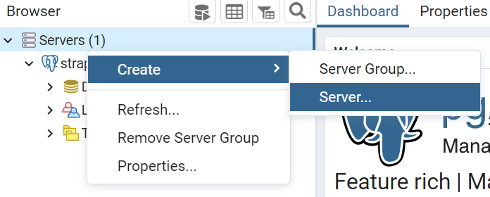
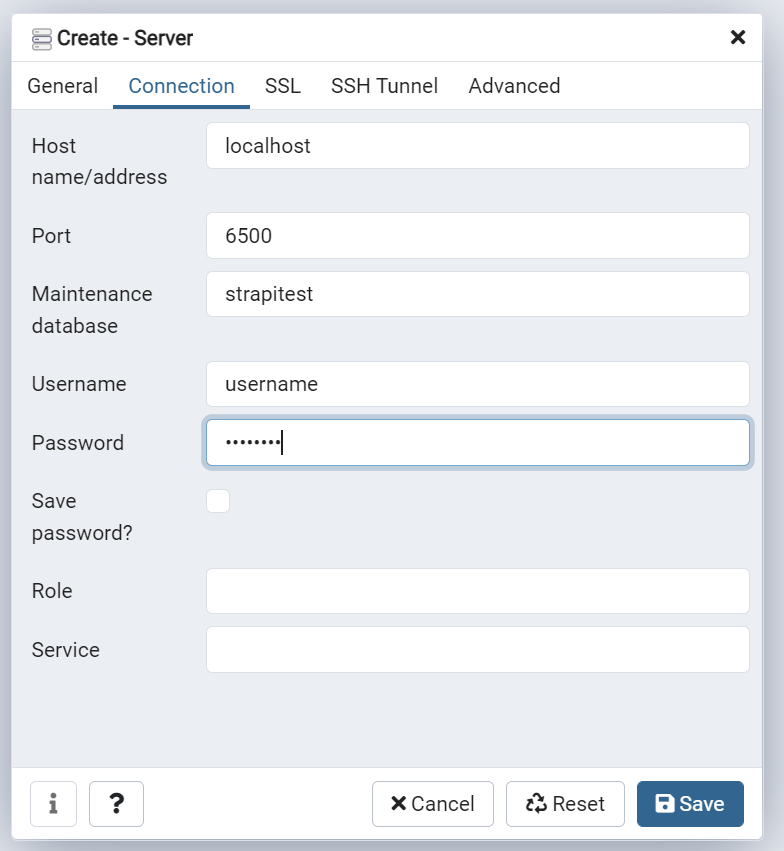

# Markeplace

## Getting Started

* execute `docker-compose up --force-recreate` from the repo root directory
* Go to `http://localhost:5050/` and set up pgAdmin to view database with login

  * `admin@admin.com`
  * `123456`

* execute `yarn develop` to start the Strapi in local development mode

